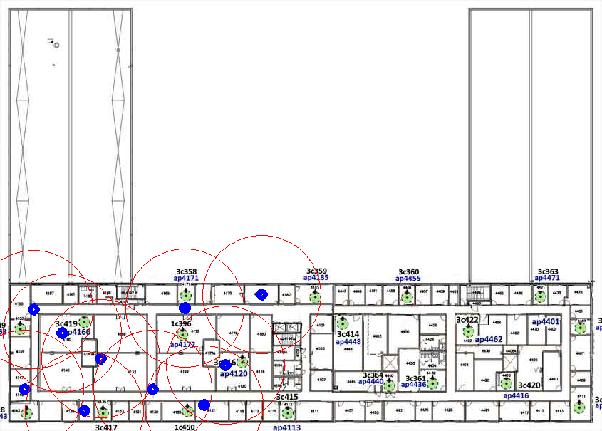

# Wifi Based Localization using Mojo Network
### CMSC 818G Project
#### Authors:
- Kanishka Ganguly
- Chahat Deep Singh
- Nitin J Sanket

***

The following data is based on AV William building (Left wing) which is equipped with Mojo Routers.

- All Router RSSI:

- Wifi Localization:

- Heat Map:


- [Terminal Output](Output/term_output.txt):

```bash
chahatdeep@archahat:~/git_cloned/MojoLens$ ./mojo_test.py 
Authenticated Successfully
Got cookie:  5leshv272faqfc0dsjrifac341
MWM URL Fetched Successfully
MWM URL:  https://mwm-at31005.mojonetworks.com
MWM Login Successful
Got MWM Cookie:  87F154115AECCEB2260456EDCCFEF253
Search Filter Successful
Client Name:  dronelaptop
Client Box ID:  1792862761
Fetching List of Observing Devices Successful
There are 13 devices observing client <dronelaptop>
AVW4-10-RM4132-8C:88:AF
AVW4-04-RM4160-8E:9A:5F
AVW4-11-HW4129-8C:99:EF
AVW3-08-RM3166-8E:F6:0F
AVW4-01-HW4157-8D:8E:9F
AVW4-03-RM4137-8E:94:EF
AVW4-05-HW4172-8C:95:3F
AVW4-02-HW4143-8C:68:6F
AVW3-01-RM3157-8E:94:5F
AVW4-06-RM4121-8E:92:7F
AVW3-04-RM3141-8E:95:4F
AVW4-07-RM4120-8E:9B:4F
AVW4-09-RM4179-8E:95:DF
Layout Fetch Successful
Floor Plan Image Key: 9223d368-bd50-4dd4-ac04-b4e42acd74e1
Fetch Floor Image Successful
Fetched 11 Sensor Placements
[Device: AVW4-10-RM4132-8C:88:AF] [Box ID: 10] [Strength: 43%] [Location: (67.7725, 241.7062)]
[Device: AVW4-02-HW4143-8C:68:6F] [Box ID: 11] [Strength: 23%] [Location: (16.3399, 262.5913)]
[Device: AVW4-11-HW4129-8C:99:EF] [Box ID: 08] [Strength: 31%] [Location: (102.8451, 262.7835)]
[Device: AVW4-05-HW4172-8C:95:3F] [Box ID: 09] [Strength: 26%] [Location: (124.6852, 207.8910)]
[Device: AVW4-01-HW4157-8D:8E:9F] [Box ID: 27] [Strength: 29%] [Location: (22.9618, 208.6317)]
[Device: AVW4-07-RM4120-8E:9B:4F] [Box ID: 22] [Strength: 15%] [Location: (152.0913, 246.4076)]
[Device: AVW4-06-RM4121-8E:92:7F] [Box ID: 13] [Strength: 16%] [Location: (137.7710, 273.3198)]
[Device: AVW4-04-RM4160-8E:9A:5F] [Box ID: 24] [Strength: 34%] [Location: (41.9732, 224.4334)]
[Device: AVW4-03-RM4137-8E:94:EF] [Box ID: 21] [Strength: 27%] [Location: (57.0342, 276.7765)]
[Device: AVW4-09-RM4179-8E:95:DF] [Box ID: 26] [Strength: 13%] [Location: (176.5345, 198.7556)]
```
